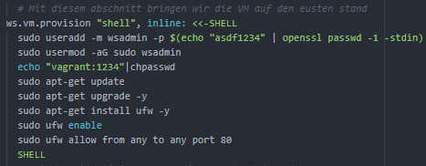

# LB01 von Silvan Bärlocher

## Auftrag
---
Unser Auftrag ist es, eine VM automatisiert aufzusetzten mit einem Vagrant File.
Dazu müssen wir Services aussuchen die wir installieren und konfigurieren mitels Vagrant File.

### Meine Idee für die LB01
Ich will zwei Server Aufsetzten.
Auf dem ersten Server läuft Teamspeak 3, welches ich auch schon selbst zum gamen benutzt habe.
Auf dem nächsten habe ich eine kleine Webseite erstellt, welche die wichtigsten Informationen zum Teamspeak Server enthält.

### Informationen
[1]: https://docs.google.com/document/d/1M-aswL3k4uI-_MYO8RLX7ExAFEzVJkUoqjAOLj9gtyY/edit
[2]: https://guides.github.com/features/mastering-markdown/
[3]: https://bscw.tbz.ch/bscw/bscw.cgi/25833849
[4]: https://github.com/silvanbaerlocher/M300-Services.git
[5]: https://wiki.ubuntuusers.de/TeamSpeak-Server/
[6]: https://wiki.ubuntuusers.de/Apache2/
[7]: https://www.teamspeak.com/en/
[8]: https://github.com/aidanns/vagrant-reload

Alle Unterlagen befinden sich im [BSCW-M300][3] Folder. Noch mehr Informationen finden sie im [Lernjournal][1] vom M300.
Dieses Dokument wurde mit [Markdown][2] geschrieben

### Nützliche Links
* [TBZ][1]
* [Mastring Markdown][2]
* [BSCW][3]
* [Mein Repository][4]
* [TeamSpeak Installation][5]
* [Apache2][6]
* [TeamSpeak][7]
* [Funktion Reload Installation][8]

## Vorbereitung
---
Zuerst suchte ich mir meine Dienste aus die ich per Vagrant installieren will heraus.
Meine Idee war es einen Teamspeak Server und dazu einen Überwachungsserver zu installieren.
Ich Installierte beide Server zuerst manuell in Virtualbox, um zu schauen was man alles machen kann und ich weiss das es läuft.
Dan fand ich heraus, dass der Überwachungsserver zu schwierig im Vagrant wird, Darum wählte ich als zweiten Server einen Apache2 Server in dem Infos von unserem TeamSpeak Server enthalten sind.

Als Vorbereitung oder absicherung installierte ich den TeamSpeak und den Apache Server einmal manuell. Um zu sehen welche befehle ich alles brauche und auf was ich alles achten muss.

## Installation
---
Grundsätzlich machten ich die Installation nach der Seite Wiki.Ubuntuusers.de.

Stolpersteine:
 * Netzwerkeinstellungen damit man von einem anderen Gerät darauf zugreiffen kann.
 * Neustarten der VM wärent dem ausführen der VM
 * Updaten der Server
 * Passwort ändern des Vagrant User

Hier ein Bild meines Vagrant Files:


---


### Konfigurieren der VM (TeamSpeak)
Grundsätzlich baute ich die VM auf, indem ich:
* Der VM einen Name definierte
* Die Box die ich brauche definierte
  Hier wählte ich ein einfaches Ubuntu mit der Version 18.04
* Der Hostname der VM definierte
* Die Netzwerkeinstellungen in Virtualbox definierte
  Hier ist wichtig, dass man den für den TeamSpeak Server den Port 9987, 30033, 10011 und 41144 und für den Apache Server 80 und 22/2223 zwingend NATet.
* Den Provider auswähle, also das Virtualisierungsprogramm
* Der Name der VM definierte
* Anzahl RAM definierte

Netzwerkeinstellugnen sollten ungefair so aussehen:

| Namen    | Protokoll | Host-IP | Host-Port | Gast-IP  | Gast-Port |
| :-------:|:---------:|:-------:|:---------:|:--------:|:---------:|
| tcp10011 | tcp       | 0.0.0.0 | 10011     | -        | 10011     |
| tcp30033 | tcp       | 0.0.0.0 | 10011     | -        | 30033     |
| tcp41144 | tcp       | 0.0.0.0 | 10011     | -        | 41144     |
| tcp9987  | udp       | 0.0.0.0 | 10011     | -        | 9987      |


### Installieren von TeamSpeak Server
Als erstes bringen wir den TeamSpeak Server auf den neusten Stand. Dies machen wir per update und upgrade. Dazu Installieren und aktivieren wir noch die Firewall und öffnen nur die Ports die wir auch wirklich brauchen. Wir erstellen gerade noch einen TeamSpeak Admin. Das Passwort des Vagrant Users ändern wir aus sicherheitsgründen auch noch.


Wichtig ist hier, dass wir den Server neustarten, damit auch alles auf dem neusten stand läuft.
Dies machen wir per ":reload", dass Funktioniert aber nur, wenn man dies auch Installiert hat (siehe hier: [Funktion Reload Installation][8]).
Danach Installieren wir TeamSpeak wie in der Anleitung beschrieben [TeamSpeak Installation][5].


Der letzte Punkt vor dem Starten des Server, ist sehr wichtig. Dieser musste ich selber herausfinde, weil dies in der Anleitung anderst gemacht wird, bei mir aber so nicht geklappt hat. In der viertletzten Zeile aktzeptieren wir die Lizenz und per sleep 10 wartet die Konsole 10 Sekunden. Würde man nicht warten crasht der Server und gibt eine Rückmeldung wie "Server seems to have died".

---


### Konfigurieren der VM (WebServer)
Grundsätzlich baute ich die VM auf, indem ich:
* Der VM einen Name definierte
* Die Box die ich brauche definierte
  Hier wählte ich ein einfaches Ubuntu mit der Version 18.04
* Der Hostname der VM definierte
* Die Netzwerkeinstellungen in Virtualbox definierte
  Hier ist wichtig, dass man den für den TeamSpeak Server den Port 9987, 30033, 10011§ und 41144 und für den Apache Server 80 und 22/2223 zwingend NATet.
* Den Provider auswähle, also das Virtualisierungsprogramm
* Der Name der VM definierte
* Anzahl RAM definierte

Netzwerkeinstellugnen sollten ungefair so aussehen:

| Namen        | Protokoll | Host-IP | Host-Port | Gast-IP  | Gast-Port |
| :-----------:|:---------:|:-------:|:---------:|:--------:|:---------:|
| tcp8080      | tcp       | 0.0.0.0 | 8080      | -        | 80        |
| tcp2223      | tcp       | 0.0.0.0 | 2223      | -        | 20s        |


### Installieren von WebServer
Als erstes bringen wir den TeamSpeak Server auf den neusten Stand. Dies machen wir per update und upgrade. Dazu Installieren und aktivieren wir noch die Firewall und öffnen nur die Ports die wir auch wirklich brauchen. Wir erstellen gerade noch einen TeamSpeak Admin. Das Passwort des Vagrant Users ändern wir aus sicherheitsgründen auch noch.



Wichtig ist hier, dass wir den Server neustarten, damit auch alles auf dem neusten stand läuft.
Dies machen wir per ":reload", dass Funktioniert aber nur, wenn man dies auch Installiert hat (siehe hier: [Funktion Reload Installation][8]).
Danach Installieren wir den Webserver wie in der Anleitung beschrieben [Apache2][6].


Hier hatte ich eigentlich keine grossen Probleme. Ausser, dass ich mich wieder ein bisschen ins HTML Codieren eindenken musste.

## Testing
---
Um das ganze zu testen, brauchen wir einen Internet explorer und TeamSpeak.

Den TeamSpeak können Sie entweder von der [TeamSpeak][7] Seite herunterladen oder von meinem Repo unter M300-Services/Vagrant/LB01/Software/TeamSpeakClient.

### TeamSpeak Testing
1. TeamSpeak Starten
2. Oben links auf Verbindungen
3. Verbinden
4. Server Adresse eingebem (in meinem Fall 10.71.13.13)
5. Verbinden
Hier einige Bilder


### WebServer Testing
1. Webbroswser öffnen
2. Server adresse mit Port in der Suche eingeben (10.71.13.13:8080)

Hier ein Bild. Ich testete es einfach per localhost. Wenn dies auf einem externen Gerät getestet wird, muss dies mit der Server IP gemacht werden.


## Wichtige Befehle!!!
---
```
- Virtueller Maschine einen Name geben
  vb.name = "TeamSpeak-Server"
- Benutzer erstellen
  sudo useradd -m tsadmin -p $(echo "asdf1234" | openssl passwd -1 -stdin)
- Benutzer Sudo rechte geben
  sudo usermod -aG sudo tsadmin
- Passwort eines Benutzers ändern
  echo "vagrant:1234"|chpasswd
- Firewall Installieren und konfigurieren
  sudo apt-get install ufw -y
  sudo ufw enable
  sudo ufw allow from any to any  port 9987
- Neustart einer VM
  ts.vm.provision :reload
```
